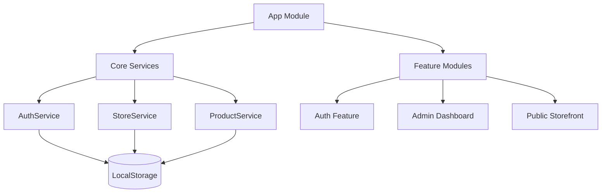

# 🏗️ CJStore Architecture

This document provides a technical deep-dive into the CJStore platform's architecture, data flow, and services.

## System Overview

CJStore is built as a **Single Page Application (SPA)** using **Angular 19**. It follows a standard modular architecture with a clear separation between core logic, UI components, and feature modules.

## Core Services

### 1. `StoreService`
Responsible for all store-related operations.
- **State Management**: Uses `signal<Store[]>` for reactive updates.
- **Seeding**: Automatically seeds demo stores if `localStorage` is empty.
- **Methods**: `getAll()`, `getBySlug(slug)`, `create(data)`, `update(id, data)`.

### 2. `ProductService`
Manages the product catalog for all vendors.
- **Data Model**: `Product` interface includes `storeId` to link products to specific stores.
- **Filtering**: Includes a multi-criteria `search()` method for the storefront.

### 3. `AuthService`
Handles user registration, login, and session persistence.
- **Storage**: Stores users in `cjstore_users` and the current session in `cjstore_session` (within LocalStorage).

## Data Storage Strategy

Currently, CJStore uses a **Client-Side First** approach. 

| Storage Key | Content | Purpose |
|-------------|---------|---------|
| `cjstore_stores` | Array of Store objects | Vendor profiles and settings |
| `cjstore_products` | Array of Product objects | Global product catalog |
| `cjstore_users` | Array of User objects | Account credentials |
| `cjstore_session` | User object | Active login session |

> [!NOTE]
> This strategy is ideal for development and MVP (Minimum Viable Product) stages as it requires zero server setup. However, it is **not suitable** for production where multiple users need to see the same data across different browsers.

## Key Component Patterns

### Public Storefront (`StoreHomeComponent`)
- **Dynamic Routing**: Uses `:slug` to fetch specific store details on load.
- **Reactive URL**: WhatsApp links are computed dynamically based on the current store's number.

### Admin Dashboard (`StoreSettingsComponent`)
- **Reactive Forms**: Uses `FormBuilder` to manage store settings and product edits with real-time validation.
- **Isolated Access**: Checks `AuthService` to ensure a vendor can only edit their own shop's data.
